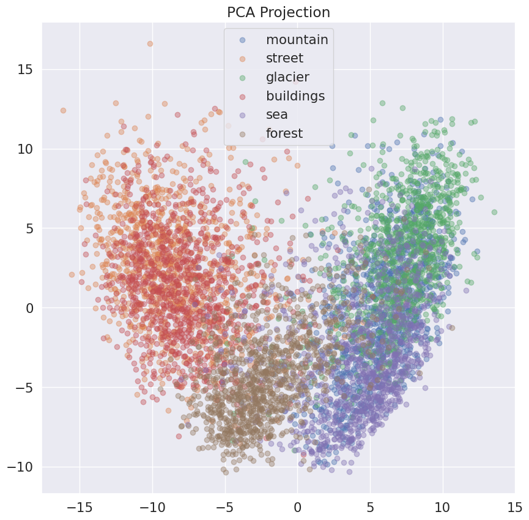
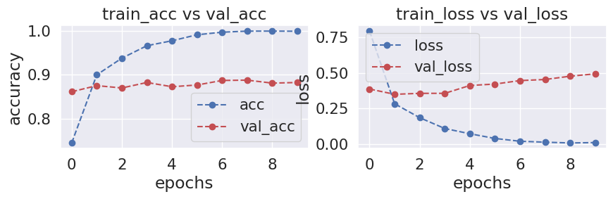
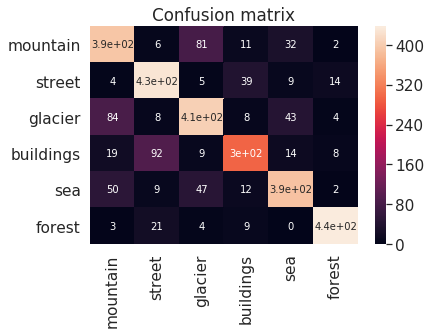
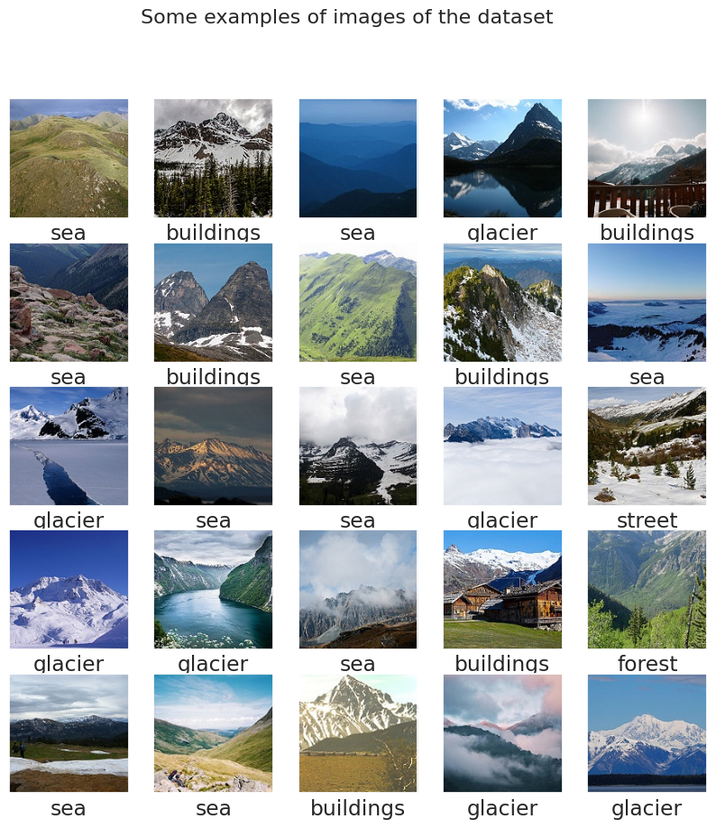
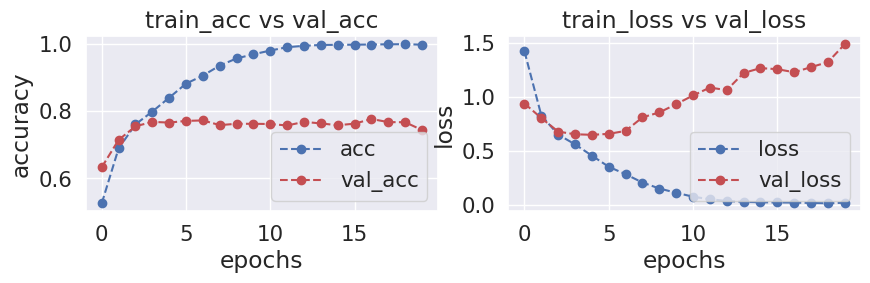

# Intel Image Classification (CNN - Keras)

## Giới thiệu

Dự án này thực hiện bài toán **phân loại ảnh (Image Classification)** trên bộ dữ liệu **Intel Image Classification** bằng các phương pháp học sâu với **Convolutional Neural Network (CNN)** và **Transfer Learning**.

Các phương pháp được triển khai bao gồm:

- Xây dựng một mô hình CNN cơ bản bằng **Keras/TensorFlow**.
- Tiền xử lý và trực quan hóa dữ liệu ảnh.
- Đánh giá hiệu suất mô hình thông qua tập kiểm tra.
- Phân tích lỗi để tìm hiểu các trường hợp mô hình dự đoán sai.
- Sử dụng mô hình **VGG16 được huấn luyện trước trên ImageNet** để trích xuất đặc trưng (feature extraction).
- Huấn luyện mạng nơ-ron trên các đặc trưng được trích xuất từ VGG16.
- Trực quan hóa không gian đặc trưng bằng **PCA**.
- Fine-tuning VGG16 để cải thiện khả năng phân loại.

Bộ dữ liệu bao gồm 6 nhóm cảnh quan:

- Buildings
- Forest
- Glacier
- Mountain
- Sea
- Street

---

## Dataset

Dự án sử dụng bộ dữ liệu **Intel Image Classification**, bao gồm các hình ảnh về cảnh quan tự nhiên và đô thị để phục vụ bài toán phân loại ảnh.

### Thông tin bộ dữ liệu

- **Tên bộ dữ liệu:** Intel Image Classification
- **Số lớp:** 6
- **Các lớp:** Buildings, Forest, Glacier, Mountain, Sea và Street
- **Kích thước ảnh:** 150 × 150 pixels (RGB)

Bộ dữ liệu được chia thành **tập huấn luyện (training set)** và **tập kiểm tra (testing set)**, được sử dụng để huấn luyện và đánh giá hiệu suất của các mô hình **CNN** và **VGG16 Transfer Learning**.

## Results

Các mô hình được đánh giá dựa trên độ chính xác (accuracy) trên tập kiểm tra.

Kết quả quan sát:

- Mô hình CNN cơ bản có khả năng học được các đặc trưng quan trọng từ ảnh.
- Các lớp **Forest** được nhận diện với độ chính xác cao.
- Một số lớp có đặc điểm hình ảnh tương đồng gây khó khăn cho mô hình:
  - Glacier và Mountain.
  - Building và Street.
  - Sea và Glacier.

Việc sử dụng **VGG16 pretrained on ImageNet** giúp mô hình tận dụng các đặc trưng đã được học từ tập dữ liệu lớn, từ đó cải thiện khả năng phân loại so với việc huấn luyện CNN từ đầu.

---
### PCA Projection

  

Biểu diễn các điểm dữ liệu sau khi giảm chiều bằng **PCA (Principal Component Analysis)**. Kết quả cho thấy một số lớp có sự chồng lấn, thể hiện rằng không gian đặc trưng vẫn chưa phân tách hoàn toàn giữa các nhóm dữ liệu.

---

### Ensemble Accuracy

  

Độ chính xác của mô hình khi áp dụng kỹ thuật **Ensemble Learning**, kết hợp nhiều mô hình nhằm cải thiện hiệu suất phân loại.

---

### Confusion Matrix

  

Ma trận nhầm lẫn thể hiện số lượng dự đoán đúng và sai của từng lớp, giúp đánh giá những cặp lớp mà mô hình thường nhầm lẫn.

---

### Mislabeled Images

  

Các hình ảnh bị mô hình dự đoán sai hoặc có mức độ nhầm lẫn cao, hỗ trợ quá trình phân tích lỗi và xác định những trường hợp khó phân loại.

---

### Training Accuracy

  

Biểu đồ thể hiện độ chính xác của mô hình trên tập huấn luyện và tập xác thực trong quá trình huấn luyện từ đầu, giúp đánh giá khả năng hội tụ và phát hiện hiện tượng overfitting hoặc underfitting.

## Images

Một số hình ảnh minh họa trong quá trình thực hiện:

- Phân bố dữ liệu trong các lớp.
- Các ảnh mẫu từ bộ dữ liệu.
- Kết quả trực quan hóa đặc trưng bằng PCA.
- Ma trận nhầm lẫn (Confusion Matrix).
- Ví dụ các dự đoán đúng và sai của mô hình.

---

## Cài đặt

Clone repository:

bash:
git clone https://github.com/nguyenhoanghuy34/cnn-intel-image-classification.git
cd intel-image-classification-cnn

pip install -r requirements.txt

Các thư viện chính được sử dụng:

Python
TensorFlow / Keras
NumPy
OpenCV
Scikit-learn
Matplotlib
Seaborn

Chạy notebook:

jupyter notebook

Sau đó mở file notebook để thực hiện quá trình huấn luyện và đánh giá mô hình.
